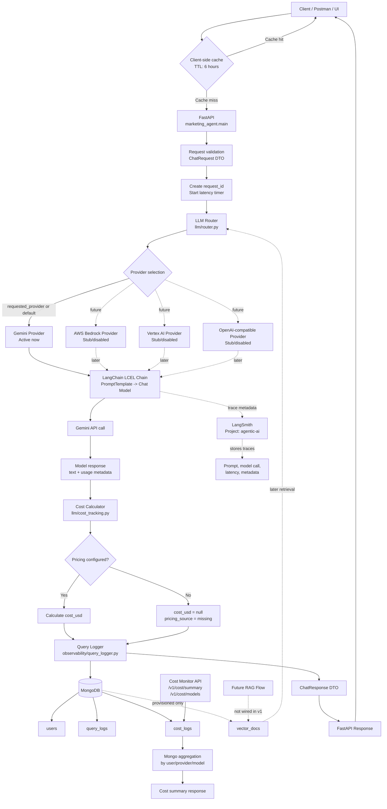
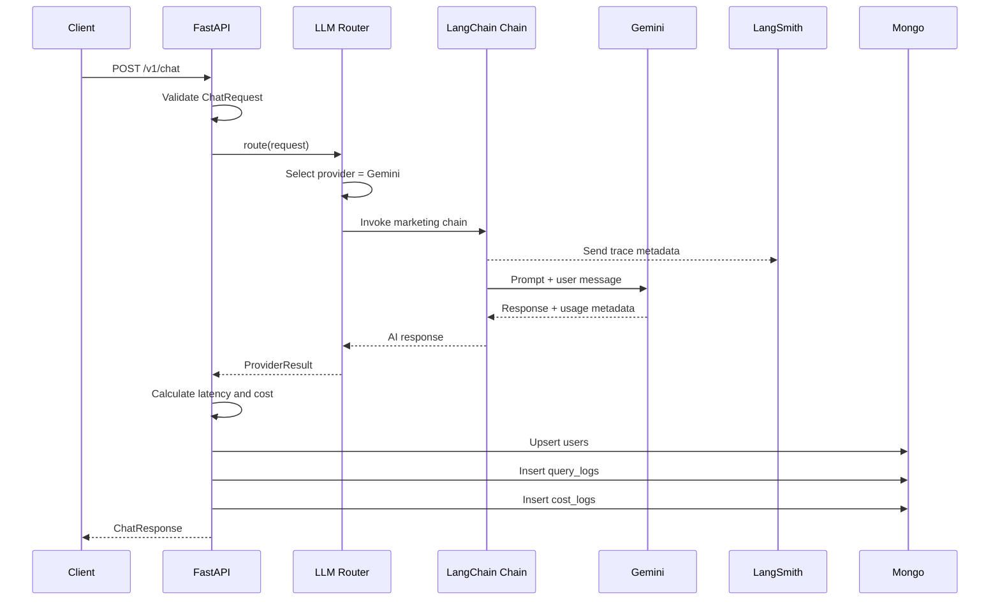

# Marketing Agent Flowchart

## End-To-End Sequence

## Component Map

| Component | File / Module | Purpose |
|---|---|---|
| API entrypoint | `main.py` | Creates FastAPI app and mounts routes |
| Chat API | `api/routes_chat.py` | Handles `/v1/chat`, `/v1/response/`, `/v1/health` |
| Cost API | `api/routes_cost.py` | Handles cost summary endpoints |
| Settings | `core/config.py` | Loads env values, feature flags, provider config |
| Mongo access | `db/mongo.py` | MongoDB client and collection accessors |
| DTOs | `models/dto.py` | Request/response schemas |
| Router | `llm/router.py` | Chooses provider and invokes LangChain chain |
| Chain | `llm/chains.py` | Marketing prompt and LCEL chain |
| Gemini provider | `llm/providers/gemini.py` | Active Gemini model adapter |
| Future providers | `llm/providers/bedrock.py`, `vertex.py`, `openai_like.py` | Provider adapters for later use |
| Cost tracking | `llm/cost_tracking.py` | Calculates cost from token usage and pricing config |
| LangSmith | `observability/langsmith_tracing.py` | Enables tracing and project config |
| Mongo logging | `observability/query_logger.py` | Writes users, query logs, and cost logs |
| Vector placeholder | `db/vector_client.py` | Future RAG/vector DB extension |

