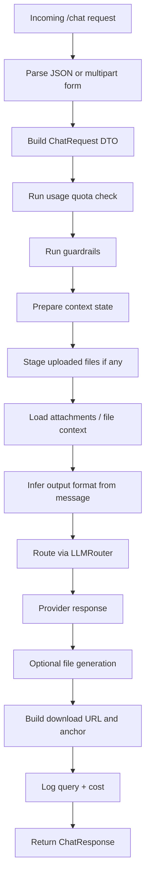
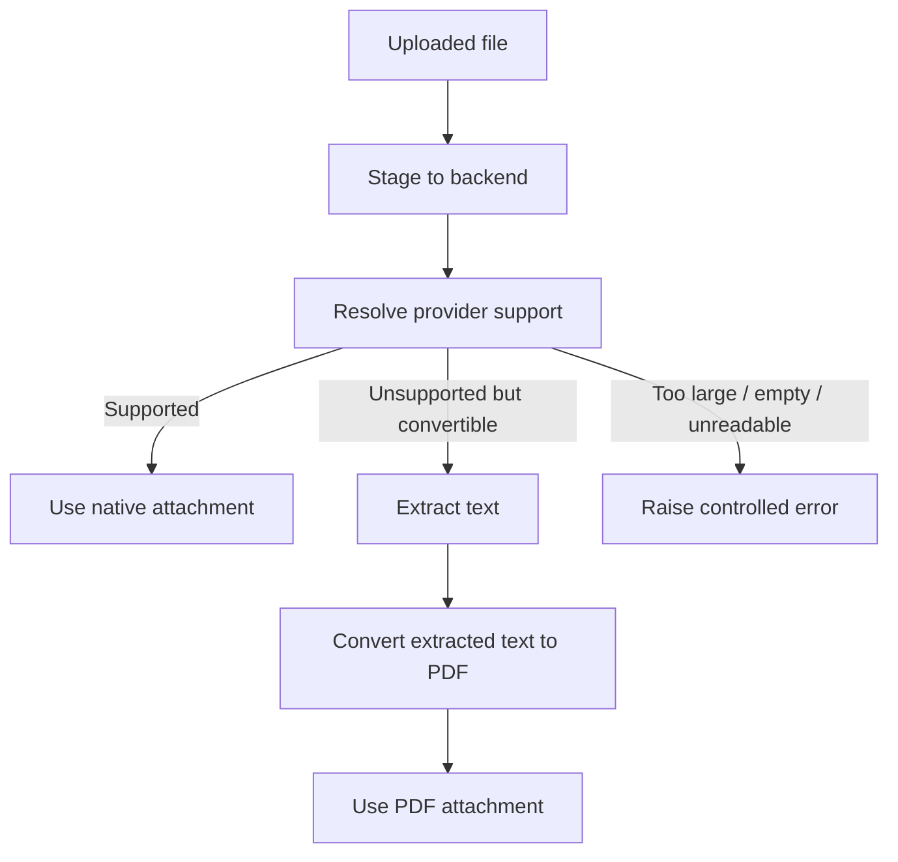

# Marketing Agent Codebase Guide

## 1. Purpose of This Document
This document is meant to help a new engineer understand the `marketing_agent` service quickly enough to:

- run it locally
- understand the main request flows
- trace how prompts, providers, files, logging, and cost work
- safely make changes
- debug common issues

This is not just a feature summary. It is an implementation-oriented guide for developers who need to work on the codebase.

## 2. What This Service Does
The Marketing Agent is a FastAPI-based multi-provider GenAI service that supports:

- normal text chat
- chat with attached files
- marketing-specific and generic assistant behavior
- context retention across sessions
- file generation in `docx`, `pptx`, `pdf`, and `xlsx`
- local or S3-backed file storage
- provider routing across Gemini, Bedrock, Vertex, and OpenAI-like models
- request logging, cost tracking, and usage quota monitoring

The current architecture is centered around one primary chat endpoint and a modular orchestration layer.

## 3. High-Level Architecture
```mermaid
flowchart TD
    A[Client / Frontend] --> B[FastAPI App]
    B --> C[/chat endpoint]
    C --> D[Guardrails + Quota Check]
    D --> E[Context Preparation]
    E --> F[File Service]
    E --> G[LLM Router]
    F --> G
    G --> H[Provider Layer]
    H --> I[Gemini]
    H --> J[Bedrock]
    H --> K[Vertex]
    H --> L[OpenAI-like]
    G --> M[Tool-based File Generation]
    M --> N[Storage Backend]
    N --> O[Local Storage]
    N --> P[S3 Storage]
    C --> Q[Query Logger + Cost Logger]
    Q --> R[MongoDB]
```

## 4. Main Entry Points
### 4.1 App bootstrap
Primary application entry:

- [main.py](c:/Users/P043123/Work_Projects/Agentic-Ai/marketing_agent/main.py)

Responsibilities:

- configure logging
- configure LangSmith tracing
- initialize FastAPI
- add request context middleware
- register routers
- patch OpenAPI schema for binary uploads

### 4.2 Dependency injection
Shared singleton-style dependencies:

- [dependencies.py](c:/Users/P043123/Work_Projects/Agentic-Ai/marketing_agent/dependencies.py)

This file constructs:

- `Settings`
- `MongoStore`
- `LLMRouter`
- `FileService`
- `CostCalculator`
- `ConversationContextManager`
- `QueryLogger`

If you are changing object wiring, caching, or service composition, this is one of the first files to inspect.

## 5. Main Folder Structure
### 5.1 API layer
- `marketing_agent/api/routes_chat.py`
- `marketing_agent/api/routes_cost.py`
- `marketing_agent/api/chat_helpers.py`

### 5.2 Core configuration
- `marketing_agent/core/config.py`
- `marketing_agent/core/logging.py`

### 5.3 LLM orchestration
- `marketing_agent/llm/router.py`
- `marketing_agent/llm/chains.py`
- `marketing_agent/llm/context_manager.py`
- `marketing_agent/llm/prompt_registry.py`
- `marketing_agent/llm/guardrails.py`
- `marketing_agent/llm/cost_tracking.py`

### 5.4 Providers
- `marketing_agent/llm/providers/base.py`
- `marketing_agent/llm/providers/bedrock.py`
- `marketing_agent/llm/providers/gemini.py`
- `marketing_agent/llm/providers/vertex.py`
- `marketing_agent/llm/providers/openai_like.py`

### 5.5 Storage and file generation
- `marketing_agent/storage/file_service.py`
- `marketing_agent/storage/backends.py`
- `marketing_agent/storage/text_extractors.py`
- `marketing_agent/storage/docx_generation.py`
- `marketing_agent/storage/pptx_generation.py`
- `marketing_agent/storage/pdf_generation.py`
- `marketing_agent/storage/xlsx_generation.py`

### 5.6 Tool calling
- `marketing_agent/tools/file_generation_tools.py`

### 5.7 Persistence and observability
- `marketing_agent/db/mongo.py`
- `marketing_agent/db/schemas.py`
- `marketing_agent/models/dto.py`
- `marketing_agent/observability/query_logger.py`
- `marketing_agent/observability/langsmith_tracing.py`
- `marketing_agent/observability/request_context.py`

### 5.8 Governance
- `marketing_agent/governance/usage_quota.py`

## 6. Primary Runtime Flow
The most important file in the service is:

- [routes_chat.py](c:/Users/P043123/Work_Projects/Agentic-Ai/marketing_agent/api/routes_chat.py)

This file owns the end-to-end chat request orchestration.

### 6.1 Chat request flow


### 6.2 Supported input modes
The chat endpoint supports both:

- `application/json`
- `multipart/form-data`

This is important because the service is backward compatible for plain JSON chat while also supporting file uploads.

### 6.3 Why `routes_chat.py` is large
This file is currently the coordination layer for:

- endpoint definitions
- request parsing
- chat execution
- file listing/downloading
- history/session endpoints
- health endpoint

If future cleanup is needed, this is the best candidate for further extraction into smaller modules.

## 7. Request Model vs Database Schemas
This is a common source of confusion.

### 7.1 DTOs
API request/response contracts live in:

- [dto.py](c:/Users/P043123/Work_Projects/Agentic-Ai/marketing_agent/models/dto.py)

These are used for:

- incoming request validation
- outgoing response serialization
- OpenAPI schema generation

Examples:

- `ChatRequest`
- `ChatResponse`
- `UsageMonitorResponse`

### 7.2 DB Schemas
MongoDB document models live in:

- `marketing_agent/db/schemas.py`

These are used for:

- logging to MongoDB
- user documents
- query logs
- cost logs
- session summaries

Simple distinction:

- `dto.py` = API contract
- `schemas.py` = database document shape

## 8. Prompt System
Prompt profiles are defined in:

- `marketing_agent/prompts/prompts.yaml`

Prompt loading is handled by:

- [prompt_registry.py](c:/Users/P043123/Work_Projects/Agentic-Ai/marketing_agent/llm/prompt_registry.py)

### 8.1 Current prompt profiles
The service supports at least:

- `marketing`
- `generic`

### 8.2 How prompt selection works
The router normalizes `department` and then maps it to a prompt profile.

Current behavior:

- `marketing` department uses the marketing prompt profile
- `generic` department uses the generic prompt profile
- fallback uses the configured default prompt profile

### 8.3 Prompt composition
`PromptRegistry.build_system_prompt()` combines:

- system prompt
- guardrails
- response style

Context summary and summarization prompt are also sourced from the same YAML file.

## 9. Provider Routing
Provider routing is implemented in:

- [router.py](c:/Users/P043123/Work_Projects/Agentic-Ai/marketing_agent/llm/router.py)

This file is the brain of the inference layer.

### 9.1 Responsibilities
- choose provider
- choose model
- choose prompt profile
- decide direct file mode vs text context mode
- invoke the provider
- optionally invoke LangChain tool calling for file generation
- merge usage data from multi-step flows

### 9.2 Current provider behavior
Supported providers:

- `gemini`
- `bedrock`
- `vertex`
- `openai_like`

Important default rules:

- `marketing` defaults to `bedrock`
- `generic` can use the configured default provider
- if `department=marketing` and `requested_provider=gemini`, router blocks that path

### 9.3 Model selection
The router resolves model in this order:

1. `requested_model`
2. department + provider-specific default
3. provider default from settings

### 9.4 Router output
The router returns a `RouteResult` containing:

- `route_decision`
- `provider_result`
- `effective_session_id`
- optional `generated_summary`
- optional `generated_file`

## 10. LLM Execution Modes
The service currently has multiple execution patterns.

### 10.1 Text context mode
Used when:

- there are no provider-native file attachments
- or file content is converted into text context

Implemented via:

- [chains.py](c:/Users/P043123/Work_Projects/Agentic-Ai/marketing_agent/llm/chains.py)

### 10.2 Direct file mode
Used when:

- provider supports native file attachments
- uploaded files are passed directly to the model

Examples:

- Bedrock Converse `document` and `image` content blocks
- Gemini uploaded file flow

### 10.3 Tool-calling mode
The newer path for generated deliverables.

Used when the user explicitly asks for:

- `docx`
- `pptx`
- `pdf`
- `xlsx`

There are two variants:

- `text_context_tool`
- `direct_file_tool`

`direct_file_tool` means:

1. provider analyzes the attached file directly
2. the result is fed into a LangChain tool-enabled follow-up step
3. the tool writes the final output file

## 11. Tool-Based File Generation
The current LangChain file tools are defined in:

- [file_generation_tools.py](c:/Users/P043123/Work_Projects/Agentic-Ai/marketing_agent/tools/file_generation_tools.py)

### 11.1 What these tools do
They wrap file generation functions as `StructuredTool` objects for:

- `generate_docx_file`
- `generate_pptx_file`
- `generate_pdf_file`
- `generate_xlsx_file`

### 11.2 Why this was added
Earlier, file generation was purely post-processing logic. The newer design moves toward:

- model decides when to call a generation tool
- output file writing happens through one consistent service
- normal chat and attached-file flows converge

### 11.3 Important design note
The tool does not generate the content itself.

It receives final content from the model and then:

- writes the file via `FileService`
- returns metadata such as path and storage URI

This separation is important:

- LLM creates content
- storage/generator code creates files

## 12. File Processing Architecture
Main file orchestration lives in:

- [file_service.py](c:/Users/P043123/Work_Projects/Agentic-Ai/marketing_agent/storage/file_service.py)

### 12.1 Responsibilities
- stage input files
- read stored files
- load attachments for providers
- convert unsupported provider/file combinations to PDF when possible
- enforce attachment size limits
- write output files
- choose local or S3 storage backend

### 12.2 File preparation flow


### 12.3 Supported storage backends
Configured in:

- `MARKETING_STORAGE_BACKEND`

Implementations:

- local filesystem
- S3

Storage backend code lives in:

- `marketing_agent/storage/backends.py`

### 12.4 Input and output naming
Input files are staged with a prefixed safe filename.

Output files use session-based rolling names like:

- `session_id_response_1.docx`
- `session_id_response_2.pptx`

This prevents overwriting previous outputs within the same session.

## 13. File Extraction and Conversion
Text extraction lives in:

- `marketing_agent/storage/text_extractors.py`

### 13.1 What it supports
- PDF text extraction
- DOCX text extraction
- PPTX text extraction
- XLSX text extraction
- JSON / text-like content reading

### 13.2 Why it matters
This module is used when:

- file content must be added to prompt context
- unsupported file types must be converted into a PDF-compatible representation
- provider-native file support is unavailable or insufficient

## 14. Output File Generators
### 14.1 Word
- `marketing_agent/storage/docx_generation.py`

Current capabilities:

- heading conversion
- paragraph conversion
- list conversion
- markdown table to real Word table conversion
- page border styling

### 14.2 PowerPoint
- `marketing_agent/storage/pptx_generation.py`

Current capabilities:

- branded Pramerica visual styling
- multiple slide layouts
- structured content rendering

### 14.3 PDF
- `marketing_agent/storage/pdf_generation.py`

Current capabilities:

- structured headings and paragraphs
- lists
- markdown table rendering into bordered layouts

### 14.4 Excel
- `marketing_agent/storage/xlsx_generation.py`

Used for generating structured spreadsheet-style outputs from model-produced content.

## 15. Context and Session Handling
Context handling lives in:

- `marketing_agent/llm/context_manager.py`

### 15.1 What it does
- fetches recent chat turns for the same `user_id + session_id`
- builds conversation history
- manages session rollover when context gets too large
- persists session summaries

### 15.2 Important behavior
Context is retained by session unless disabled by request.

The system tries to ensure:

- latest user question is always prioritized
- prior history is reference only

This is also reinforced in prompt construction.

## 16. Guardrails
Guardrail logic is in:

- `marketing_agent/llm/guardrails.py`

This layer is used before provider invocation.

Examples of guardrail intent:

- block suspicious SQL-injection-like patterns
- reject certain unsupported or unsafe requests
- keep assistant behavior within expected business scope

There are also prompt-level guardrails inside `prompts.yaml`.

## 17. Logging, Observability, and MongoDB
### 17.1 Mongo wrapper
Database access lives in:

- [mongo.py](c:/Users/P043123/Work_Projects/Agentic-Ai/marketing_agent/db/mongo.py)

`MongoStore` provides collection access for:

- `users`
- `query_logs`
- `cost_logs`
- `vector_docs`

### 17.2 Query logger
Request logging lives in:

- [query_logger.py](c:/Users/P043123/Work_Projects/Agentic-Ai/marketing_agent/observability/query_logger.py)

On success it writes:

- user info
- query log
- cost log

On failure it writes:

- failed query log with `provider=unknown`, `model=unknown`, and `route_decision=failed_before_provider`

### 17.3 Request context
Each request is given lightweight request metadata by middleware.

This is used so Mongo write logs can include:

- HTTP method
- request path

### 17.4 LangSmith
LangSmith tracing can be enabled via settings and environment variables.

The app configures tracing very early during startup.

## 18. Cost Tracking
Cost calculation lives in:

- `marketing_agent/llm/cost_tracking.py`

API reporting lives in:

- `marketing_agent/api/routes_cost.py`

### 18.1 How cost is computed
Cost is derived from:

- provider
- model
- token usage
- pricing map from `MARKETING_MODEL_PRICING_JSON`

### 18.2 Important behavior
If stored `cost_usd` is missing in historical logs, reporting endpoints can recalculate it from current pricing config.

## 19. Usage Quota Governance
Quota logic lives in:

- [usage_quota.py](c:/Users/P043123/Work_Projects/Agentic-Ai/marketing_agent/governance/usage_quota.py)

### 19.1 Current quota model
Quota is currently enforced primarily on:

- monthly `cost_usd`

Warnings are triggered at:

- 75%
- 90%

Requests are blocked at:

- 100% and above

### 19.2 Inactive users
If user document has `is_active = false`, requests are blocked.

### 19.3 Usage monitoring API
Available from:

- `/cost/usage-monitor`

This can return:

- a single-user quota status
- a dashboard-style response for all users

## 20. Configuration
Central configuration lives in:

- [config.py](c:/Users/P043123/Work_Projects/Agentic-Ai/marketing_agent/core/config.py)

### 20.1 Important configuration categories
- API prefix
- provider credentials and defaults
- MongoDB connection
- prompt file selection
- pricing config
- temperature and context limits
- storage backend
- S3 details
- usage limits
- LangSmith configuration

### 20.2 Most important env vars to know first
- `MARKETING_API_PREFIX`
- `MARKETING_DEFAULT_PROVIDER`
- `MARKETING_GEMINI_MODEL`
- `MARKETING_BEDROCK_MODEL_ID`
- `AWS_REGION`
- `GEMINI_API_KEY`
- `MARKETING_BEDROCK_API_KEY`
- `MONGODB_URI`
- `MONGODB_DB_NAME`
- `MARKETING_MODEL_PRICING_JSON`
- `MARKETING_STORAGE_BACKEND`
- `MARKETING_S3_BUCKET`
- `MARKETING_LOCAL_STORAGE_ROOT`
- `MARKETING_DEFAULT_TEMPERATURE`
- `MARKETING_MONTHLY_COST_LIMIT_USD`

## 21. API Surface
The two main routers are:

- `routes_chat.py`
- `routes_cost.py`

### 21.1 Core chat endpoints
- `POST /chat`
- `POST /chat-with-files` if still present for backward compatibility
- `GET /history`
- `GET /sessions`
- session deactivation endpoint
- file list/download endpoint
- health endpoint

### 21.2 Cost/governance endpoints
- `GET /cost/summary`
- `GET /cost/models`
- `GET /cost/usage-monitor`

## 22. Response Design
The main response object is `ChatResponse`.

Common response fields:

- `request_id`
- `reply`
- `provider`
- `model`
- `route_decision`
- `usage`
- `cost_usd`
- `output_file_uri`
- `output_file_type`
- `output_file_name`
- `download_url`
- `download_anchor`

When output file generation succeeds, frontend can use:

- `download_url`
- or `download_anchor`

## 23. Common End-to-End Scenarios
### 23.1 Plain chat
User sends normal text.

Flow:

- parse request
- apply guardrails and quota
- prepare context
- route to provider
- log response and cost

### 23.2 Chat with attached file
User uploads a file and asks a question about it.

Flow:

- file is staged
- provider-native direct file mode is used if supported
- otherwise extracted text is used
- response is logged

### 23.3 Generate a file without attachments
User asks:

- "Create a proposal in docx"
- "Generate a ppt on X"

Flow:

- output format inferred from message
- LangChain tool-enabled path used
- tool writes output file
- download URL returned

### 23.4 Analyze an attached file and generate a new output file
User uploads a file and asks:

- "Summarize this and export as pdf"
- "Create a PowerPoint from this document"

Flow:

1. provider analyzes file directly
2. tool-enabled follow-up generates final output file
3. output file metadata is returned

## 24. Where to Make Changes
### 24.1 Change prompt behavior
- `marketing_agent/prompts/prompts.yaml`
- `marketing_agent/llm/prompt_registry.py`

### 24.2 Change provider/model selection rules
- `marketing_agent/llm/router.py`

### 24.3 Change multipart or JSON request behavior
- `marketing_agent/api/routes_chat.py`

### 24.4 Change download link or reply formatting
- `marketing_agent/api/chat_helpers.py`

### 24.5 Change file support, conversion, or size handling
- `marketing_agent/storage/file_service.py`
- `marketing_agent/storage/text_extractors.py`

### 24.6 Change document/ppt/pdf/xlsx rendering
- `marketing_agent/storage/docx_generation.py`
- `marketing_agent/storage/pptx_generation.py`
- `marketing_agent/storage/pdf_generation.py`
- `marketing_agent/storage/xlsx_generation.py`

### 24.7 Change cost or quota behavior
- `marketing_agent/llm/cost_tracking.py`
- `marketing_agent/governance/usage_quota.py`
- `marketing_agent/api/routes_cost.py`

### 24.8 Change Mongo logging structure
- `marketing_agent/observability/query_logger.py`
- `marketing_agent/db/schemas.py`

## 25. Common Debugging Playbook
### 25.1 Provider not configured
Check:

- credentials in `.env`
- provider enablement flags
- model IDs
- `GET /health`

### 25.2 Files not downloading
Check:

- `output_file_uri` in query log metadata
- storage backend mode
- download URL generation in `chat_helpers.py`
- local file existence or S3 object existence

### 25.3 Wrong prompt/profile behavior
Check:

- `department` normalization in DTO
- prompt profile resolution in router
- prompt YAML content

### 25.4 Cost missing
Check:

- `MARKETING_MODEL_PRICING_JSON`
- model name matching
- provider/model in stored cost log

### 25.5 Attached file errors
Check:

- provider support for the given file type
- auto-conversion logic in `file_service.py`
- attachment size after conversion
- error mapping in `chat_helpers.py`

### 25.6 Tool-generated file missing
Check:

- inferred output format from message
- whether request went through `text_context_tool` or `direct_file_tool`
- `generated_file` returned by router
- backend write result in `FileService`

## 26. Local Run Instructions
From repo root:

```powershell
cd c:\Users\P043123\Work_Projects\Agentic-Ai
.\venv\Scripts\Activate.ps1
python -m uvicorn marketing_agent.main:app --reload --port 8004
```

## 27. Recommended Onboarding Path for a New Engineer
Read these in order:

1. [main.py](c:/Users/P043123/Work_Projects/Agentic-Ai/marketing_agent/main.py)
2. [dependencies.py](c:/Users/P043123/Work_Projects/Agentic-Ai/marketing_agent/dependencies.py)
3. [routes_chat.py](c:/Users/P043123/Work_Projects/Agentic-Ai/marketing_agent/api/routes_chat.py)
4. [router.py](c:/Users/P043123/Work_Projects/Agentic-Ai/marketing_agent/llm/router.py)
5. [file_service.py](c:/Users/P043123/Work_Projects/Agentic-Ai/marketing_agent/storage/file_service.py)
6. [file_generation_tools.py](c:/Users/P043123/Work_Projects/Agentic-Ai/marketing_agent/tools/file_generation_tools.py)
7. [prompts.yaml](c:/Users/P043123/Work_Projects/Agentic-Ai/marketing_agent/prompts/prompts.yaml)
8. [query_logger.py](c:/Users/P043123/Work_Projects/Agentic-Ai/marketing_agent/observability/query_logger.py)
9. [routes_cost.py](c:/Users/P043123/Work_Projects/Agentic-Ai/marketing_agent/api/routes_cost.py)

If someone understands those files, they can already work productively in this codebase.

## 28. Current Technical Direction
The codebase is moving toward a clearer separation of concerns:

- routing and business decisions in router/API
- provider-specific handling in provider modules
- file generation through tool-based orchestration
- storage abstracted behind `FileService`

The most important active design trend is this:

- file generation is no longer just post-processing
- it is becoming an explicit tool-calling workflow

That is the direction future enhancements should align with.

