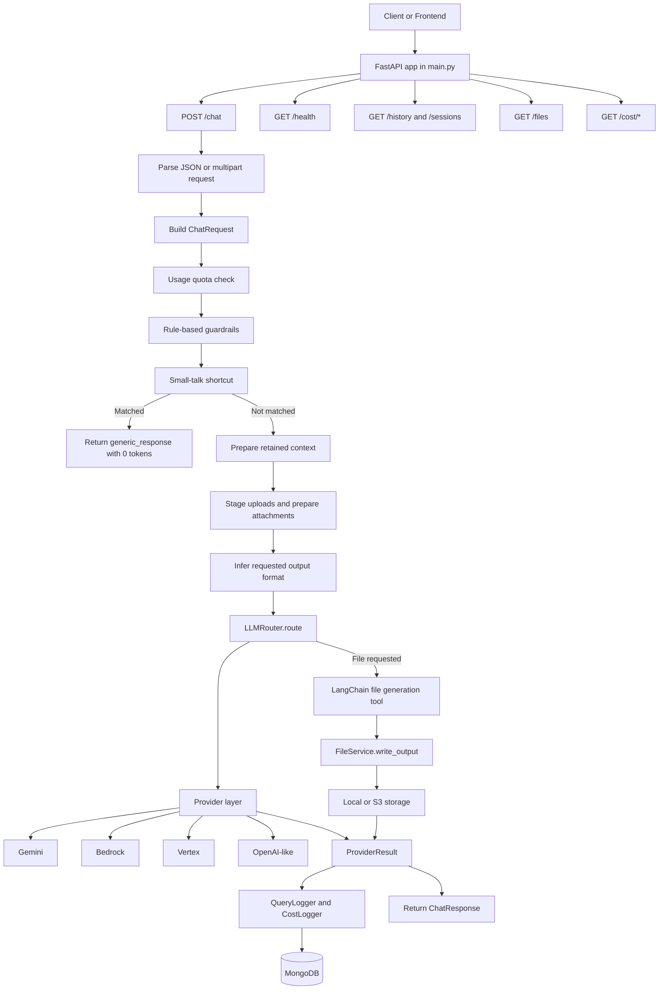

# Marketing Agent Codebase Guide

## 1. Purpose

This guide is for engineers who need to understand, run, debug, or extend the `marketing_agent` service. It reflects the current implementation of the FastAPI service under `marketing_agent/`.

Use it to understand:

- the API entry points
- request orchestration for chat, files, tool calling, logging, and cost
- provider routing across Gemini, Bedrock, Vertex, and OpenAI-like backends
- storage and generated file handling
- quota, guardrails, and observability
- where to make common changes safely

For a file-by-file reference, see `MARKETING_AGENT_PYTHON_FILE_REFERENCE.md`.

## 2. What The Service Does

The Marketing Agent is a FastAPI-based GenAI service for enterprise marketing and generic assistant workflows.

It supports:

- plain chat
- deterministic no-LLM replies for simple small talk such as greetings
- multipart chat with uploaded files
- provider-native file analysis when supported
- text extraction fallback when direct file handling is unavailable
- generated deliverables in `docx`, `pptx`, `pdf`, and `xlsx`
- LangChain tool calling for generated file workflows
- context retention and session rollover
- local or S3-backed storage
- MongoDB logging for queries, users, costs, and session summaries
- quota monitoring and blocking
- LangSmith tracing when configured

## 3. Runtime Architecture



## 4. Main Entry Points

### App bootstrap

File: `marketing_agent/main.py`

Responsibilities:

- configure Python logging
- load settings and configure LangSmith tracing before routers are imported
- create the FastAPI app
- add request-context middleware
- add CORS middleware
- include chat and cost routers
- patch OpenAPI binary schemas for multipart uploads
- run Uvicorn on port `8004` when executed directly

### Dependency wiring

File: `marketing_agent/dependencies.py`

This module exposes cached dependency factories for:

- `Settings`
- `MongoStore`
- `LLMRouter`
- `CostCalculator`
- `QueryLogger`
- `ConversationContextManager`
- `FileService`

If you are changing shared object construction or adding a new singleton-style service, start here.

## 5. Folder Map

```text
marketing_agent/
  api/              FastAPI route handlers and request helper utilities
  core/             configuration and logging setup
  db/               MongoDB store and document schemas
  governance/       quota evaluation
  llm/              chains, routing, context, prompts, guardrails, cost
  llm/providers/    Gemini, Bedrock, Vertex, OpenAI-like provider adapters
  models/           API DTOs
  observability/    query logging, request context, LangSmith setup
  prompts/          YAML prompt profiles
  storage/          storage backends, file service, extractors, renderers
  tools/            LangChain file-generation tools
```

## 6. API Surface

### Chat router

File: `marketing_agent/api/routes_chat.py`

Current endpoints:

- `GET /health`
- `POST /chat`
- `GET /history`
- `GET /sessions`
- `POST /sessions/deactivate`
- `GET /files`

`POST /chat` supports:

- `application/json`, currently restricted to `department="marketing"` for compatibility
- `multipart/form-data`, used for file uploads and full chat functionality

There is no active `/chat-with-files` endpoint in the current router. File upload support is handled by `POST /chat` with multipart form data.

### Cost router

File: `marketing_agent/api/routes_cost.py`

Current endpoints:

- `GET /cost/summary`
- `GET /cost/models`
- `GET /cost/usage-monitor`

## 7. Primary Chat Flow

The most important runtime path is `_execute_chat()` in `routes_chat.py`.

Current order:

1. Create `request_id` and timer.
2. Resolve initial provider hint from request or settings.
3. Evaluate quota through `evaluate_usage_quota()`.
4. Run `GuardrailEngine().evaluate()`.
5. Check `_generic_small_talk_reply()` for simple greetings and thanks.
6. Prepare conversation context if `retain_context=True`.
7. Load provider attachments through `FileService.load_attachments()`.
8. If direct files are not supported, build text context with `FileService.load_files_for_prompt()`.
9. Infer requested output format from the message.
10. Route through `LLMRouter.route()`.
11. Normalize provider reply.
12. Calculate cost.
13. Write output file if needed.
14. Build download URL and anchor if an output file exists.
15. Log success and cost through `QueryLogger`.
16. Return `ChatResponse`.

Error paths map known file errors to user-friendly responses and log failures when query logging is enabled.

## 8. No-LLM Small Talk Shortcut

Simple generic messages are handled before context preparation and before provider routing.

Implementation:

- detector: `marketing_agent/api/chat_helpers.py::_generic_small_talk_reply`
- caller: `marketing_agent/api/routes_chat.py::_execute_chat`

Examples that return without an LLM call:

- `hello`
- `hi`
- `how are you?`
- `hello, how are you?`
- `thanks`
- `bye`

The response uses:

- `provider="generic_response"`
- `model="generic_response"`
- `route_decision="generic_small_talk_no_llm"`
- `usage` tokens all `0`
- `cost_usd=0.0`

The detector is intentionally conservative. Mixed requests such as `hello create a campaign deck` still go through the normal LLM workflow.

## 9. Request And Response Models

File: `marketing_agent/models/dto.py`

Main DTOs:

- `ChatRequest`
- `ChatResponse`
- `TokenUsage`
- `HealthResponse`
- `HistoryItem`
- `HistoryResponse`
- `SessionItem`
- `SessionListResponse`
- `SessionDeactivateRequest`
- `SessionDeactivateResponse`
- `CostSummaryItem`
- `CostSummaryResponse`
- `UsageMonitorResponse`
- `UsageMonitorDashboardResponse`

Important behavior:

- `ChatRequest.department` is normalized to lowercase.
- `ChatRequest.message` must be non-empty.
- `temperature` is constrained from `0` to `2`.

## 10. Database Documents

File: `marketing_agent/db/schemas.py`

MongoDB document models:

- `UserDocument`
- `TokenUsageDocument`
- `CostLogDocument`
- `QueryLogDocument`
- `VectorDocDocument`
- `SessionSummaryDocument`

Simple rule:

- `models/dto.py` defines API contracts.
- `db/schemas.py` defines MongoDB document shapes.

## 11. Provider Routing

File: `marketing_agent/llm/router.py`

`LLMRouter` owns:

- provider registry construction
- provider readiness checks
- prompt profile selection
- default provider selection
- model selection
- context rollover summarization
- direct file mode
- text context mode
- tool-calling mode
- token usage merging for multi-call workflows

Supported provider names:

- `gemini`
- `bedrock`
- `vertex`
- `openai_like`

Current routing rules:

- `department="marketing"` defaults to `bedrock`.
- `department="generic"` uses the configured default provider unless the request overrides it.
- `department="marketing"` with `provider="gemini"` is rejected by the router.
- `requested_model` wins over provider defaults.
- Generic Gemini defaults to `gemini-2.5-flash`.
- Generic Bedrock defaults to `us.anthropic.claude-sonnet-4-6`.
- Marketing Bedrock uses `MARKETING_BEDROCK_MODEL_ID` or the router fallback.

`LLMRouter.route()` returns a `RouteResult` with:

- `route_decision`
- `provider_result`
- `effective_session_id`
- optional `generated_summary`
- optional `generated_file`

## 12. LLM Execution Modes

### Text context mode

Used when there are no direct provider attachments, or when file content has been extracted and injected as prompt context.

Core function:

- `marketing_agent/llm/chains.py::build_assistant_chain`

Route marker:

- `file_mode=text_context`

### Direct file mode

Used when attachments exist and the selected provider supports direct files.

Examples:

- Gemini multimodal messages
- Bedrock Converse document and image content blocks

Route marker:

- `file_mode=direct_file`

### Tool-calling mode

Used when the user requests an output file format and a matching LangChain tool exists.

Route markers:

- `file_mode=text_context_tool`
- `file_mode=direct_file_tool`

In `direct_file_tool` mode:

1. The provider analyzes attached files directly.
2. The analysis is passed to a tool-enabled follow-up model call.
3. The model calls a file-generation tool.
4. The tool writes the file through `FileService`.
5. The final chat response includes file metadata and download links.

## 13. Prompt System

Prompt file:

- `marketing_agent/prompts/prompts.yaml`

Prompt loader:

- `marketing_agent/llm/prompt_registry.py`

Profiles currently defined:

- `marketing`
- `generic`

Prompt composition includes:

- agent system prompt
- prompt-level guardrails
- response style
- context header
- summarization prompt
- guardrail response strings

Profile selection is done in `LLMRouter._resolve_prompt_profile()`.

## 14. Guardrails

File: `marketing_agent/llm/guardrails.py`

The guardrail layer runs before any provider invocation.

It blocks:

- SQL injection-like patterns such as `union select`, `drop table`, and `or 1=1`
- clearly unrelated out-of-scope hints when there is no business or Pramerica context

It allows valid marketing, insurance, and business requests even if the wording is generic.

## 15. Context And Sessions

File: `marketing_agent/llm/context_manager.py`

`ConversationContextManager.prepare()`:

- fetches recent successful query logs for the same `user_id` and `session_id`
- converts history into compact text
- estimates context size
- triggers rollover when the estimated context is above `CONTEXT_MAX_TOKENS`
- creates a new rollover session id when needed

When rollover is required, `LLMRouter` summarizes the old history and uses the summary as carried-forward context.

## 16. File Handling

File orchestration:

- `marketing_agent/storage/file_service.py`

`FileService` handles:

- local or S3 backend selection
- staging uploaded files
- reading files for prompt context
- preparing provider-native attachments
- converting unsupported provider file types to PDF when possible
- enforcing the `4_500_000` byte attachment limit
- rendering output file bytes
- writing generated outputs
- picking non-overwriting session output filenames

Provider direct-file support is currently:

- Gemini: PDF and common image formats
- Bedrock: PDF, CSV, Word, Excel, HTML, Markdown, text/log files, and common image formats
- Other providers: treated as direct-file capable by the local support check, though actual provider behavior still depends on the provider implementation

## 17. Storage Backends

File: `marketing_agent/storage/backends.py`

Backends:

- `LocalStorageBackend`
- `S3StorageBackend`

Configuration:

- `MARKETING_STORAGE_BACKEND=local|s3`
- local root: `MARKETING_LOCAL_STORAGE_ROOT`
- local input/output directories: `MARKETING_LOCAL_INPUT_DIR`, `MARKETING_LOCAL_OUTPUT_DIR`
- S3 bucket and prefixes: `MARKETING_S3_BUCKET`, `MARKETING_S3_INPUT_PREFIX`, `MARKETING_S3_OUTPUT_PREFIX`

## 18. File Extraction And Rendering

Text extraction:

- `marketing_agent/storage/text_extractors.py`

Supported extraction targets include:

- PDF
- DOCX
- PPTX
- XLSX
- JSON
- text-like files

Output renderers:

- `marketing_agent/storage/docx_generation.py`
- `marketing_agent/storage/pptx_generation.py`
- `marketing_agent/storage/pdf_generation.py`
- `marketing_agent/storage/xlsx_generation.py`

The renderers receive model-generated content and produce bytes for the requested file type.

## 19. Tool Calling For File Generation

File:

- `marketing_agent/tools/file_generation_tools.py`

Available tools:

- `generate_docx_file`
- `generate_pptx_file`
- `generate_pdf_file`
- `generate_xlsx_file`

Tool inputs include:

- `generated_text`
- `session_id`
- optional `output_file_path`

The tools do not decide the content. The model provides content, and the tools render/write the file through `FileService`.

## 20. Logging And Observability

### Mongo store

File: `marketing_agent/db/mongo.py`

`MongoStore` exposes:

- `users`
- `query_logs`
- `cost_logs`
- `vector_docs`

It also creates useful indexes on startup.

### Query logger

File: `marketing_agent/observability/query_logger.py`

On success, it writes:

- user document update
- query log
- cost log

On failure, it writes:

- failed query log with `status="error"`
- `provider="unknown"`
- `model="unknown"`
- `route_decision="failed_before_provider"`

### Request context

File: `marketing_agent/observability/request_context.py`

The middleware in `main.py` stores method/path context for observability during request handling.

### LangSmith

File: `marketing_agent/observability/langsmith_tracing.py`

Tracing is configured during startup if enabled by settings.

## 21. Cost And Quota

### Cost calculation

File:

- `marketing_agent/llm/cost_tracking.py`

Cost uses:

- provider
- model
- token usage
- `MARKETING_MODEL_PRICING_JSON`

Pricing lookup supports keys like:

- `provider:model`
- `model`

### Cost APIs

File:

- `marketing_agent/api/routes_cost.py`

The cost APIs summarize stored cost logs and can recalculate missing historical cost values from current pricing configuration.

### Quota enforcement

File:

- `marketing_agent/governance/usage_quota.py`

Quota checks:

- inactive users are blocked
- monthly cost quota blocks at or above 100 percent
- warning starts at 75 percent
- stronger warning starts at 90 percent
- daily request count is calculated and returned, but the current block condition is monthly cost

Limits can come from:

- user document
- department document
- default settings

## 22. Configuration

File:

- `marketing_agent/core/config.py`

Settings are loaded from `.env` and `.env.development`, or `.env.production` when `ENV=production`.

Important environment variables:

- `MARKETING_API_PREFIX`
- `MARKETING_DEFAULT_PROVIDER`
- `ENABLE_PROVIDER_GEMINI`
- `ENABLE_PROVIDER_BEDROCK`
- `ENABLE_PROVIDER_VERTEX`
- `ENABLE_PROVIDER_OPENAI_LIKE`
- `GEMINI_API_KEY`
- `MARKETING_GEMINI_MODEL`
- `AWS_REGION`
- `MARKETING_BEDROCK_API_KEY`
- `MARKETING_BEDROCK_MODEL_ID`
- `GOOGLE_PROJECT_ID`
- `VERTEX_LOCATION`
- `MARKETING_VERTEX_MODEL`
- `OPENAI_API_KEY`
- `OPENAI_BASE_URL`
- `MARKETING_OPENAI_MODEL`
- `MONGODB_URI`
- `MONGODB_DB_NAME`
- `MARKETING_COLLECTION_PREFIX`
- `MARKETING_MODEL_PRICING_JSON`
- `MARKETING_STORAGE_BACKEND`
- `MARKETING_LOCAL_STORAGE_ROOT`
- `MARKETING_S3_BUCKET`
- `CONTEXT_MAX_TOKENS`
- `CONTEXT_HISTORY_TURNS`
- `MARKETING_DAILY_REQUEST_LIMIT`
- `MARKETING_MONTHLY_COST_LIMIT_USD`
- `MARKETING_USAGE_WARNING_PERCENT`
- `LANGSMITH_API_KEY`
- `LANGSMITH_PROJECT`
- `ENABLE_LANGSMITH_TRACING`

## 23. Common Scenarios

### Plain chat

Flow:

1. Request is parsed into `ChatRequest`.
2. Quota and guardrails run.
3. Small-talk shortcut may return immediately.
4. Context is prepared.
5. Router invokes selected provider.
6. Query and cost are logged.

### Chat with file upload

Flow:

1. Multipart parser stages uploaded files through `FileService.stage_input_file()`.
2. `_execute_chat()` loads provider attachments.
3. Provider direct-file mode is used when possible.
4. Otherwise extracted file text is injected into prompt context.
5. Response is logged.

### Generate a file

Example prompts:

- `Create a campaign brief as docx`
- `Generate a ppt on this product`
- `Export this summary as pdf`
- `Make an excel table`

Flow:

1. `_infer_output_format_from_message()` detects the file type.
2. `_wants_file_generation()` confirms file-generation intent.
3. Router uses `invoke_assistant_with_file_tool()`.
4. Model calls the matching LangChain tool.
5. Tool writes the file through `FileService`.
6. Response includes `output_file_uri`, `output_file_type`, `output_file_name`, `download_url`, and `download_anchor`.

### Analyze uploaded file and generate a new file

Flow:

1. Uploaded file is staged.
2. Provider analyzes the attachment directly when supported.
3. Analysis is passed into a tool-enabled follow-up call.
4. The selected generation tool writes the output file.
5. Chat response returns both answer text and download metadata.

## 24. Where To Make Changes

- Change endpoint behavior: `marketing_agent/api/routes_chat.py`
- Change request helper logic: `marketing_agent/api/chat_helpers.py`
- Change provider routing or model defaults: `marketing_agent/llm/router.py`
- Change prompt wording: `marketing_agent/prompts/prompts.yaml`
- Change prompt loading/composition: `marketing_agent/llm/prompt_registry.py`
- Change guardrails: `marketing_agent/llm/guardrails.py`
- Change context retention/rollover: `marketing_agent/llm/context_manager.py`
- Change provider-specific implementation: `marketing_agent/llm/providers/*.py`
- Change file upload, conversion, output writing: `marketing_agent/storage/file_service.py`
- Change local/S3 behavior: `marketing_agent/storage/backends.py`
- Change generated file rendering: `marketing_agent/storage/*_generation.py`
- Change LangChain tools: `marketing_agent/tools/file_generation_tools.py`
- Change Mongo document shape: `marketing_agent/db/schemas.py`
- Change logging: `marketing_agent/observability/query_logger.py`
- Change cost summary APIs: `marketing_agent/api/routes_cost.py`
- Change quota logic: `marketing_agent/governance/usage_quota.py`
- Change settings/env names: `marketing_agent/core/config.py`

## 25. Debugging Playbook

### Small-talk still calls Gemini or another LLM

Check:

- the running Uvicorn process was restarted after code changes
- message matches `_generic_small_talk_reply()` patterns
- request does not include files
- response should show `provider="generic_response"`

### Provider not configured

Check:

- `GET /health`
- provider enablement flags
- provider API keys
- region/project/model settings

### Marketing request rejects Gemini

This is current router behavior. Marketing defaults to Bedrock and explicitly rejects `department="marketing"` with Gemini.

### File upload fails

Check:

- file is non-empty
- file size after preparation is under the attachment limit
- provider direct-file support
- conversion path in `FileService._prepare_attachment_for_provider()`
- user-friendly error mapping in `chat_helpers.py`

### Generated file missing

Check:

- message contains both generation intent and a target file type
- route decision includes `text_context_tool` or `direct_file_tool`
- matching tool exists in `LLMRouter.file_generation_tools`
- `FileService.write_output()` completed
- storage backend path or S3 object exists

### Cost missing or zero

Check:

- provider returned usage metadata
- `MARKETING_MODEL_PRICING_JSON` contains matching `provider:model` or `model`
- cost logs were written
- small-talk and guard responses intentionally have zero cost

### Wrong prompt behavior

Check:

- request `department`
- `ChatRequest.normalize_department()`
- `LLMRouter._resolve_prompt_profile()`
- profile content in `prompts.yaml`

## 26. Local Run

From the repo root:

```powershell
cd C:\Users\P043123\Work_Projects\Agentic-Ai
.\venv\Scripts\Activate.ps1
python -m uvicorn marketing_agent.main:app --reload --port 8004
```

OpenAPI docs are available at:

```text
http://localhost:8004/docs
```

## 27. Recommended Reading Order

1. `marketing_agent/main.py`
2. `marketing_agent/dependencies.py`
3. `marketing_agent/api/routes_chat.py`
4. `marketing_agent/api/chat_helpers.py`
5. `marketing_agent/llm/router.py`
6. `marketing_agent/llm/chains.py`
7. `marketing_agent/storage/file_service.py`
8. `marketing_agent/tools/file_generation_tools.py`
9. `marketing_agent/prompts/prompts.yaml`
10. `marketing_agent/observability/query_logger.py`
11. `marketing_agent/api/routes_cost.py`

## 28. Current Design Direction

The current architecture is moving toward:

- API routes for request parsing and response assembly
- `LLMRouter` for provider/model/workflow decisions
- provider modules for backend-specific API behavior
- `FileService` for storage and file preparation
- LangChain tools for explicit file generation
- MongoDB logging as the source for history, costs, and usage monitoring

Future work should preserve those boundaries where possible.
