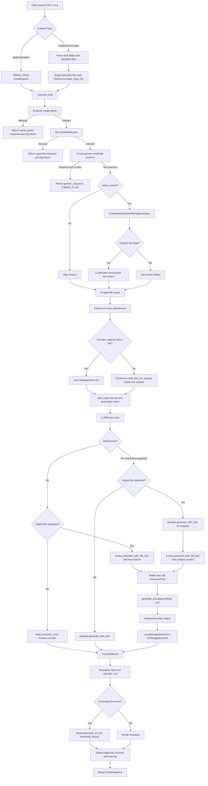

# Marketing Agent Python File Reference

This document describes every Python file under `marketing_agent/` and how the files participate in the current runtime. It is meant to complement `MARKETING_AGENT_CODEBASE_GUIDE.md`.

## End-To-End Workflow With Tool Calling

## Top-Level Package Files

### `marketing_agent/__init__.py`

Package marker for the marketing agent module. It allows imports such as `marketing_agent.main` and `marketing_agent.api.routes_chat`.

### `marketing_agent/main.py`

FastAPI application bootstrap.

Key responsibilities:

- configures logging
- loads settings
- configures LangSmith before router import
- creates `FastAPI(...)`
- adds request-context middleware
- adds CORS middleware
- includes chat and cost routers
- patches OpenAPI schemas for binary upload fields
- runs Uvicorn on `0.0.0.0:8004` when called as a script

Main objects/functions:

- `app`
- `add_request_context`
- `_patch_binary_schema`
- `custom_openapi`

### `marketing_agent/dependencies.py`

FastAPI dependency factory module.

It exposes cached constructors for:

- `MongoStore`
- `LLMRouter`
- `CostCalculator`
- `QueryLogger`
- `ConversationContextManager`
- `Settings`
- `FileService`

This is the central wiring point for runtime services.

## API Package

### `marketing_agent/api/__init__.py`

Package marker for API modules. It keeps route modules importable under `marketing_agent.api`.

### `marketing_agent/api/chat_helpers.py`

Shared helper functions used by `routes_chat.py`.

Key responsibilities:

- parse boolean form fields
- build query filters for history/file lookups
- mask Mongo URIs for health output
- normalize provider reply payloads into text
- detect deterministic small-talk responses without LLM calls
- build logging metadata
- infer output format from user message
- detect whether the user wants file generation
- build download URLs and anchors
- map low-level provider/file errors to user-friendly messages

Important functions:

- `_generic_small_talk_reply`
- `_infer_output_format_from_message`
- `_wants_file_generation`
- `_build_logging_metadata`
- `_map_user_file_error`

### `marketing_agent/api/routes_chat.py`

Primary chat and file API router. This is the largest orchestration file in the service.

Endpoints:

- `GET /health`
- `POST /chat`
- `GET /history`
- `GET /sessions`
- `POST /sessions/deactivate`
- `GET /files`

Key responsibilities:

- parse JSON and multipart chat requests
- stage uploaded files
- run quota checks
- run guardrails
- return small-talk responses without provider calls
- prepare conversation context
- prepare attachments and file context
- infer file-generation intent
- call `LLMRouter.route`
- write output files when needed
- build download links
- log success and failure
- expose history, session, and file list/download operations

Important functions:

- `_execute_chat`
- `chat`
- `_build_file_guard_response`
- `_download_from_filters`
- `list_chat_files`

### `marketing_agent/api/routes_cost.py`

Cost and usage monitoring router.

Endpoints:

- `GET /cost/summary`
- `GET /cost/models`
- `GET /cost/usage-monitor`

Key responsibilities:

- summarize cost by user/provider/model
- summarize cost by provider/model
- recalculate missing historical costs from current pricing settings
- expose single-user quota status
- expose dashboard-style quota status across users

Important functions:

- `_effective_cost_usd`
- `_build_usage_monitor_item`
- `_usage_monitor_user_ids`
- `cost_summary`
- `model_costs`
- `usage_monitor`

## Core Package

### `marketing_agent/core/__init__.py`

Package marker for core infrastructure modules.

### `marketing_agent/core/config.py`

Central settings module based on Pydantic settings.

Key responsibilities:

- load `.env`, `.env.development`, or `.env.production`
- define provider credentials and model defaults
- define MongoDB collection settings
- define prompt, context, storage, cost, quota, and LangSmith settings
- provide resolved legacy/current environment variable behavior
- parse `MARKETING_MODEL_PRICING_JSON`

Important objects/functions:

- `Settings`
- `get_settings`
- `Settings.model_pricing`
- `Settings.resolved_mongodb_uri`
- `Settings.enable_langsmith_tracing`

### `marketing_agent/core/logging.py`

Small logging setup module.

Key responsibility:

- configure global logging level and format through `logging.basicConfig`

Important function:

- `configure_logging`

## Database Package

### `marketing_agent/db/__init__.py`

Package marker for database modules.

### `marketing_agent/db/mongo.py`

MongoDB access layer.

Key responsibilities:

- connect to MongoDB using resolved settings
- expose collection properties
- wrap mutating collection operations with logging
- ping database health
- create indexes for users, query logs, cost logs, and vector docs
- provide context-managed `mongo_store`

Important classes/functions:

- `LoggingCollection`
- `MongoStore`
- `mongo_store`

### `marketing_agent/db/schemas.py`

Pydantic models for MongoDB documents.

Document models:

- `UserDocument`
- `TokenUsageDocument`
- `CostLogDocument`
- `QueryLogDocument`
- `VectorDocDocument`
- `SessionSummaryDocument`

These models define persisted document shape, not API response contracts.

### `marketing_agent/db/vector_client.py`

Thin vector document helper.

Key responsibilities:

- upsert embedding documents into `vector_docs`
- run Atlas vector search aggregation

Note: The file states that this is provisioned vector access and is not used by chat routing in v1.

## Governance Package

### `marketing_agent/governance/usage_quota.py`

Quota evaluation module.

Key responsibilities:

- compute daily and monthly windows
- count user requests today
- aggregate monthly cost
- read user-level and department-level limits
- block inactive users
- block requests at monthly cost limit
- return warning messages at 75 percent and 90 percent usage

Important objects/functions:

- `UsageQuotaStatus`
- `evaluate_usage_quota`

## LLM Package

### `marketing_agent/llm/__init__.py`

Package marker for LLM orchestration modules.

### `marketing_agent/llm/chains.py`

LangChain chain construction and tool-call execution.

Key responsibilities:

- build the standard assistant chat prompt
- add file-generation tool instructions
- bind a single file-generation tool to an LLM
- execute first model call
- execute selected tool call
- feed tool result back into the final model call
- return response, generated file metadata, and usage responses

Important objects/functions:

- `ToolEnabledChainResult`
- `build_assistant_chain`
- `build_file_tool_instruction`
- `invoke_assistant_with_file_tool`

### `marketing_agent/llm/context_manager.py`

Conversation context manager.

Key responsibilities:

- fetch recent successful query logs for a user/session
- build history text
- estimate tokens
- decide whether context rollover is needed
- create rollover session ids
- return `ContextState`

Important objects/functions:

- `ContextState`
- `ConversationContextManager.prepare`

### `marketing_agent/llm/cost_tracking.py`

Model cost calculation module.

Key responsibilities:

- look up pricing by `provider:model` or `model`
- compute input/output token cost
- compute total token cost when separate input/output pricing is absent
- return a `CostResult`

Important objects/functions:

- `CostResult`
- `CostCalculator.calculate`

### `marketing_agent/llm/guardrails.py`

Rule-based pre-LLM guardrails.

Key responsibilities:

- detect SQL injection-like text
- detect clearly out-of-scope consumer topics
- allow marketing, insurance, and business task contexts
- return a structured allow/block decision

Important objects/functions:

- `GuardrailDecision`
- `GuardrailEngine.evaluate`

### `marketing_agent/llm/prompt_registry.py`

Prompt YAML loader and composer.

Key responsibilities:

- load `prompts/prompts.yaml`
- resolve profile-specific prompt data
- retrieve nested prompt values
- build system prompts
- build context headers
- build summarization prompts

Important objects/functions:

- `PromptRegistry`
- `get_prompt_registry`

### `marketing_agent/llm/router.py`

Provider routing and LLM workflow coordinator.

Key responsibilities:

- register providers
- expose provider status
- select default provider
- select model id
- select prompt profile
- summarize rollover context
- choose text, direct-file, or tool-calling path
- invoke provider and LangChain chains
- merge usage across multi-step calls
- return `RouteResult`

Important objects/functions:

- `RouteResult`
- `LLMRouter.route`
- `LLMRouter.provider_status`
- `LLMRouter.supports_direct_files_for_provider`

## LLM Provider Package

### `marketing_agent/llm/providers/__init__.py`

Package marker for provider adapters.

### `marketing_agent/llm/providers/base.py`

Abstract provider interface and common result types.

Key responsibilities:

- define token usage structure
- define provider result structure
- define file attachment structure
- define abstract provider interface
- provide default `generate`
- provide default usage extraction from LangChain response metadata

Important objects:

- `UsageInfo`
- `ProviderResult`
- `FileAttachment`
- `LLMProvider`

### `marketing_agent/llm/providers/gemini.py`

Gemini provider adapter.

Key responsibilities:

- check Gemini enablement and API key
- construct `ChatGoogleGenerativeAI`
- support native file/image prompt content
- build multimodal message payloads
- extract usage through base provider behavior

Important class:

- `GeminiProvider`

### `marketing_agent/llm/providers/bedrock.py`

Amazon Bedrock provider adapter.

Key responsibilities:

- configure Bedrock authentication environment
- construct Bedrock runtime client
- construct `ChatBedrockConverse`
- support direct document and image file content
- map document and image formats to Bedrock-supported values
- sanitize document names for Bedrock
- extract usage from Converse response metadata

Important class:

- `BedrockProvider`

### `marketing_agent/llm/providers/vertex.py`

Vertex AI provider adapter.

Key responsibilities:

- check Vertex enablement and project id
- construct `ChatVertexAI`
- expose configured Vertex model

Important class:

- `VertexProvider`

### `marketing_agent/llm/providers/openai_like.py`

OpenAI-compatible provider adapter.

Key responsibilities:

- check OpenAI-like enablement and API key
- construct `ChatOpenAI`
- support custom `OPENAI_BASE_URL`
- expose configured OpenAI-compatible model

Important class:

- `OpenAILikeProvider`

## Models Package

### `marketing_agent/models/__init__.py`

Package marker for API model modules.

### `marketing_agent/models/dto.py`

Pydantic DTOs for request and response contracts.

Key responsibilities:

- validate incoming chat requests
- serialize chat responses
- define health, history, session, cost, and quota API shapes
- normalize department strings

Important models:

- `ChatRequest`
- `ChatResponse`
- `TokenUsage`
- `HealthResponse`
- `CostSummaryResponse`
- `HistoryResponse`
- `SessionListResponse`
- `UsageMonitorResponse`
- `UsageMonitorDashboardResponse`

## Observability Package

### `marketing_agent/observability/__init__.py`

Package marker for observability modules.

### `marketing_agent/observability/langsmith_tracing.py`

LangSmith environment setup.

Key responsibilities:

- set LangChain/LangSmith environment variables from settings
- support legacy LangChain env variable naming
- report whether LangSmith tracing is configured

Important functions:

- `configure_langsmith`
- `langsmith_configured`

### `marketing_agent/observability/query_logger.py`

MongoDB logging module for queries, users, cost, and summaries.

Key responsibilities:

- upsert user document on query activity
- write successful query logs
- write cost logs
- write failed query logs
- write session summary documents
- safely stringify response payloads

Important class:

- `QueryLogger`

### `marketing_agent/observability/request_context.py`

Context variable holder for request metadata.

Key responsibility:

- expose `request_context` as a `ContextVar[dict]`

This is set in `main.py` middleware and can be read by lower-level code.

## Storage Package

### `marketing_agent/storage/__init__.py`

Package marker for storage modules.

### `marketing_agent/storage/backends.py`

Storage backend abstractions and implementations.

Key responsibilities:

- define abstract read/write/path methods
- implement local filesystem storage
- implement S3 storage
- resolve input paths and output paths safely for each backend

Important classes:

- `StorageBackend`
- `LocalStorageBackend`
- `S3StorageBackend`

### `marketing_agent/storage/docx_generation.py`

DOCX renderer.

Key responsibilities:

- parse generated markdown-like text into blocks
- support headings, paragraphs, bullets, numbered lists, and markdown tables
- style Word document output
- add page borders
- return DOCX bytes and file extension

Important function:

- `build_docx_bytes`

### `marketing_agent/storage/errors.py`

Storage-specific error type module.

Important class:

- `AttachmentPreparationError`

This is raised when a user-provided attachment cannot be prepared for model use.

### `marketing_agent/storage/file_service.py`

High-level file orchestration service.

Key responsibilities:

- choose storage backend from settings
- stage input files
- load files as text context
- load provider attachments
- convert unsupported file types to PDF when possible
- enforce attachment byte limit
- render generated output bytes
- write generated files
- avoid overwriting existing session output files

Important objects/functions:

- `FileReadResult`
- `FileWriteResult`
- `FileService`
- `FileService.load_attachments`
- `FileService.write_output`

### `marketing_agent/storage/pdf_generation.py`

PDF renderer.

Key responsibilities:

- parse generated markdown-like text into blocks
- render headings, paragraphs, lists, and tables
- manage page creation and page breaks
- return PDF bytes

Important function:

- `build_pdf_bytes`

### `marketing_agent/storage/pptx_generation.py`

PowerPoint renderer.

Key responsibilities:

- parse either simple markdown-like presentation text or structured slide JSON
- render branded Pramerica slides
- support multiple slide layouts
- add logo/wordmark when assets are available
- return PPTX bytes and file extension

Important functions:

- `parse_presentation_content`
- `extract_structured_slides`
- `build_structured_pptx`
- `build_thematic_pptx`
- `build_pptx_bytes`

### `marketing_agent/storage/text_extractors.py`

Text extraction module.

Key responsibilities:

- build a combined file-context block for prompts
- convert bytes to text based on file extension
- extract text from PDF, DOCX, PPTX, and XLSX
- decode JSON and text-like files
- provide conversion text for PDF fallback

Important functions:

- `build_file_context_block`
- `bytes_to_text`
- `extract_text_for_pdf_conversion`
- `extract_pdf_text`
- `extract_docx_text`
- `extract_pptx_text`
- `extract_xlsx_text`

### `marketing_agent/storage/xlsx_generation.py`

Excel renderer.

Key responsibilities:

- render generated text into a simple workbook
- split rows on lines and cells on `|`
- return XLSX bytes and file extension

Important function:

- `build_xlsx_bytes`

## Tools Package

### `marketing_agent/tools/__init__.py`

Re-export module for file-generation tool builders and renderer entry point.

Exports:

- `render_generated_file`
- `build_generate_docx_tool`
- `build_generate_pptx_tool`
- `build_generate_pdf_tool`
- `build_generate_xlsx_tool`
- `build_langchain_file_tools`
- `build_langchain_file_tool_map`

### `marketing_agent/tools/file_generation_tools.py`

LangChain file-generation tools.

Key responsibilities:

- route generated text to the correct renderer
- define Pydantic tool input schemas
- build `StructuredTool` instances for output file generation
- write tool-generated files through `FileService`
- return generated file metadata to the LLM/tool orchestration layer

Important functions/classes:

- `render_generated_file`
- `GenerateDocxToolInput`
- `GeneratePptxToolInput`
- `GeneratePdfToolInput`
- `GenerateXlsxToolInput`
- `build_generate_docx_tool`
- `build_generate_pptx_tool`
- `build_generate_pdf_tool`
- `build_generate_xlsx_tool`
- `build_langchain_file_tools`
- `build_langchain_file_tool_map`

## Quick Cross-Reference

| Change needed | Start with |
| --- | --- |
| Add or change an endpoint | `api/routes_chat.py` or `api/routes_cost.py` |
| Change small-talk behavior | `api/chat_helpers.py` |
| Change provider/model selection | `llm/router.py` |
| Add provider support | `llm/providers/` and `llm/router.py` |
| Change prompts | `prompts/prompts.yaml` and `llm/prompt_registry.py` |
| Change context memory | `llm/context_manager.py` |
| Change file upload behavior | `storage/file_service.py` |
| Change output document rendering | `storage/*_generation.py` |
| Change tool-calling file generation | `tools/file_generation_tools.py` and `llm/chains.py` |
| Change logging or persisted metadata | `observability/query_logger.py` and `db/schemas.py` |
| Change quota behavior | `governance/usage_quota.py` |
| Change cost reporting | `api/routes_cost.py` and `llm/cost_tracking.py` |
| Change env/config behavior | `core/config.py` |
